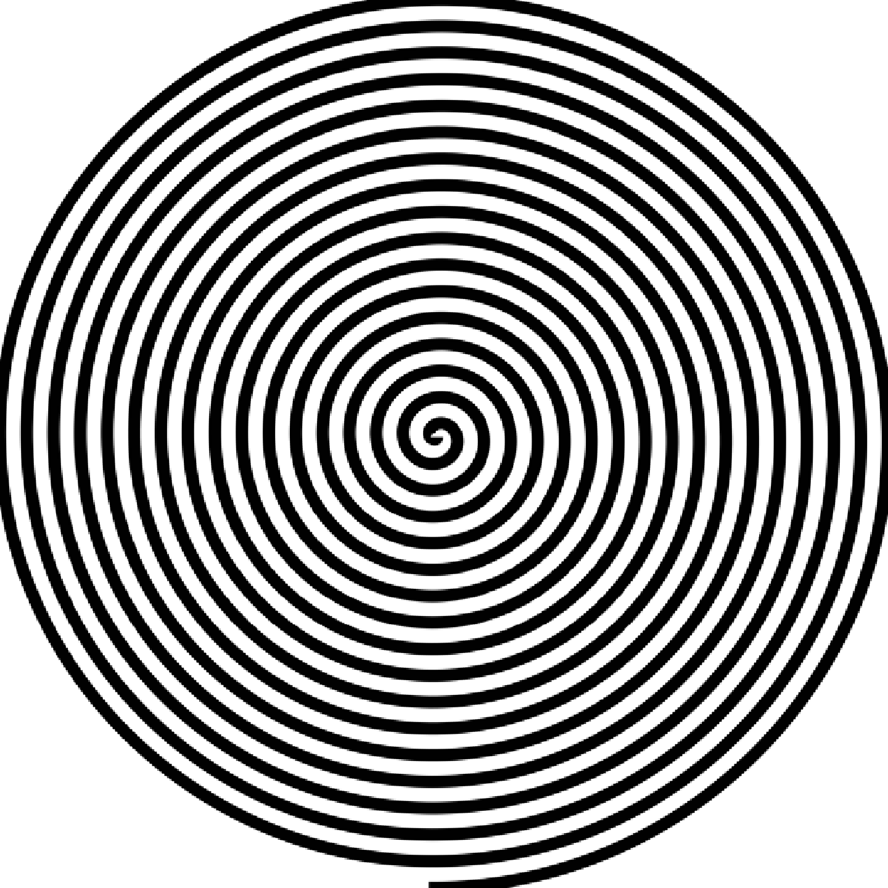
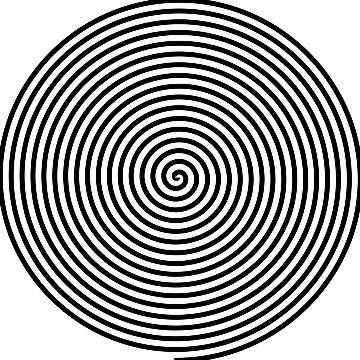
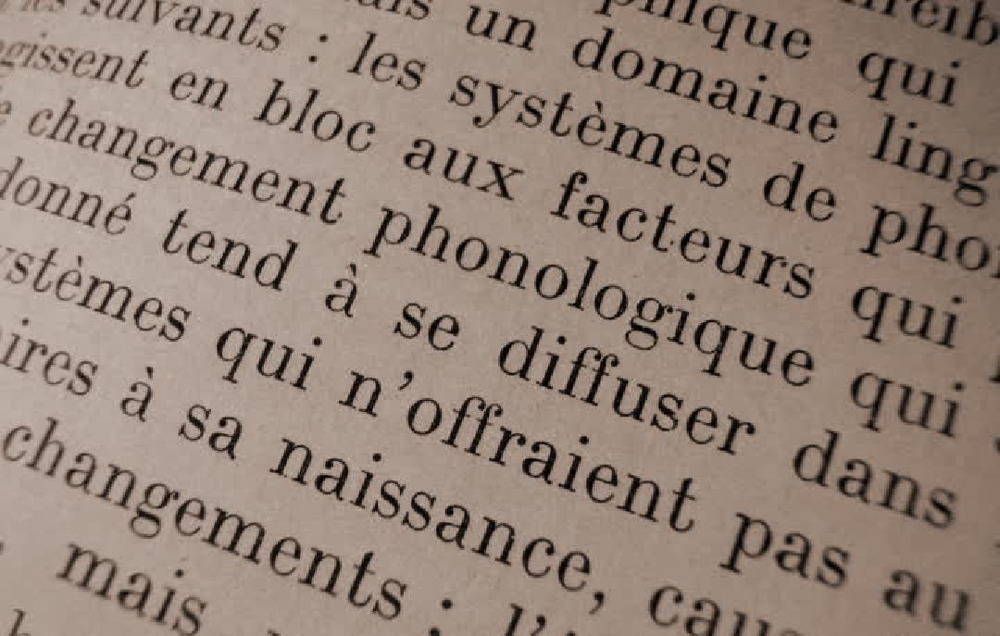
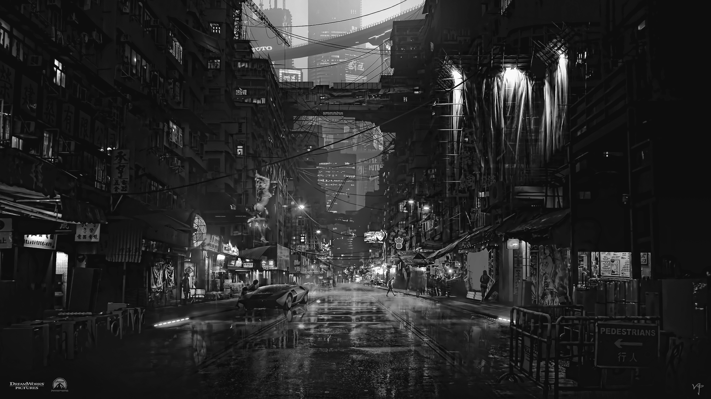
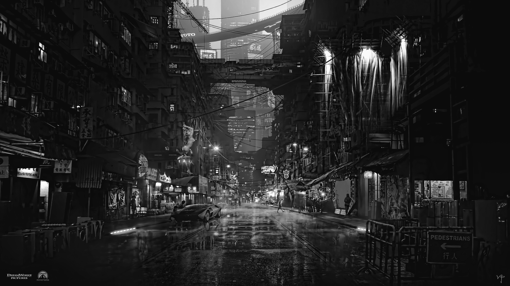

# Лабораторные работа по курсу OABИ
|**Студент:**|*Вудвуд Андрей*|
|------------|--------------|
|**Группа:** |*Б22-564*     |
|**Вариант:**|*19*           |
```sh
### Лабораторная работа №1. Цветовые модели и передискретизация изображений
### Лабораторная работа №2. Обесцвечивание и бинаризация растровых изображений
### Лабораторная работа №3. Фильтрация изображений и морфологические операции
### Лабораторная работа №4. Выделение контуров на изображении
```
### 1.  **Цветовые модели**
#### 1.1  Выделение компоненты R, G, B и сохранение как отдельные изображения. 
| images   | naruto |
|----------|------------|
| ||
|  ||

| images   |     shifu |
|----------|------------|
| ||
|  ||

| images   |     mcqueen |
|----------|------------|
| ||
|  ||

| images   |     comand7 |
|----------|------------|
| ||
|  ||


#### 1.2 Приводим изображение к цветовой модели HSI, сохраняем яркостную компоненту как отдельное изображение. 

| images исходные   |     @all |
|----------|------------|
| ||
|  ||


#### 1.3 Инвертируем яркостную компоненту в исходном изображении, сохраняем производное изображение.
| images исходные   |     @all |
|----------|------------|
| ||
|  ||


### 2. Передискретизация

Исходное изображение размером `720x458` :


Исходное изображение размером `720x720` :


#### 2.1 Растяжение (интерполяция) изображения в M раз

Интерполяция в 2 раза. Исходный размер `720x458` результирующий размер `1440x916`:


Интерполяция в 3 раза. Исходный размер `720x458` результирующий размер `2160x1374`:


---

Интерполяция в 2 раза. Исходный размер `720x720` результирующий размер `1440x1440`:



Интерполяция в 3 раза. Исходный размер `720x720` результирующий размер `2160x2160`:


#### 2.2 Сжатие (децимация) изображения в N раз

Децимация в 2 раза. Исходный размер `720x458` результирующий размер `360x229`:


Децимация в 3 раза. Исходный размер `720x458` результирующий размер `240x153`:


---

Децимация в 2 раза. Исходный размер `720x720` результирующий размер `360x360`:



Децимация в 3 раза. Исходный размер `720x720` результирующий размер `240x240`:


#### 2.3 Передискретизация изображения в K=M/N раз путём растяжения и последующего сжатия (в два прохода)

Передискретизация изображения в K=3/2 раз за два прохода. Исходный размер `720x458` результирующий размер `1080x687`:



---

Передискретизация изображения в K=3/2 раз за два прохода. Исходный размер `720x720` результирующий размер `1080x1080`:


#### 2.4 Передискретизация изображения в K раз за один проход

Передискретизация изображения в K=3/2 раз за один проход. Исходный размер `720x458` результирующий размер `1080x687`:


---

Передискретизация изображения в K=3/2 раз за один проход. Исходный размер `720x720` результирующий размер `1080x1080`:


### 2. Приведение полноцветного изображения к полутоновому

Исходное изображение:


Результирующее изображение с обычными коэффицентами:




Результирующее изображение с коэффицентами photoshop:



---

Исходное изображение:


Результирующее изображение с обычными коэффицентами:


Результирующее изображение с коэффицентами photoshop:


### 3. Приведение полутонового изображения к монохромному методом пороговой обработки

> Алгоритм адаптивной бинаризации Кристиана

Исходное изображение:


|**B \ K**		|					0.2								   |					0.6				    			  |					0.8                                  |
|---------------|------------------------------------------------------|------------------------------------------------------|------------------------------------------------------|
|**20** 		||||
|**40**			||||
|**80**			||||


---

Исходное изображение:


Результирующее изображение c `k = 0.2`, `b = 15`:


|**B \ K**		|					0.2									|					0.6									|					0.8                                 |
|---------------|-------------------------------------------------------|-------------------------------------------------------|-------------------------------------------------------|
|**20** 		||||
|**40**			||||
|**80**			||||